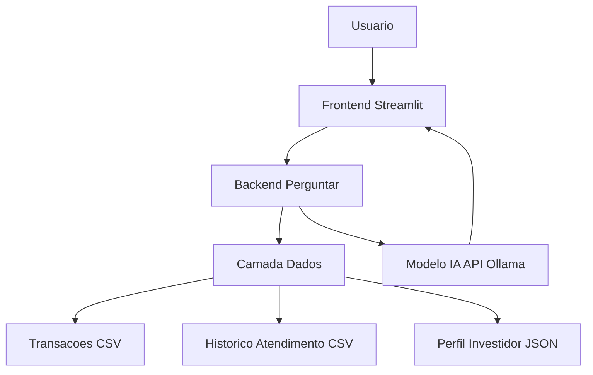

# Elena Control 💡

Elena Control é uma assistente financeira inteligente e didática, desenvolvida para ajudar usuários a entender melhor suas finanças pessoais, controlar gastos e alcançar objetivos de forma prática e motivadora.

## 🚀 Objetivo
Transformar dados financeiros em orientação clara e acessível, oferecendo alertas sobre gastos, acompanhamento de metas e educação financeira sem jargões técnicos.

## 📂 Estrutura do Projeto
- **`src/app.py`** → Aplicação principal em Streamlit, responsável pela interface de chat com o usuário.  
- **`data/transacoes.csv`** → Registro das transações financeiras recentes.  
- **`data/historico_atendimento.csv`** → Histórico de interações e atendimentos anteriores.  
- **`data/perfil_investidor.json`** → Perfil do cliente, incluindo renda, patrimônio e metas financeiras.  

## 🧠 Funcionalidades
- Análise automática de receitas e despesas.  
- Alertas quando os gastos ultrapassam a renda mensal.  
- Reforço das metas financeiras do cliente (ex.: reserva de emergência, entrada de imóvel).  
- Respostas sempre **coerentes, seguras e assertivas**, sem alucinações ou recomendações arriscadas.  
- Linguagem amigável e motivadora, adaptada ao perfil do usuário.  

## 🏗️ Arquitetura da Solução
A Elena Control foi projetada em uma arquitetura modular e simples:

1. **Interface (Frontend)**  
   - Desenvolvida em **Streamlit**, fornece uma experiência de chat interativo.  
   - Exibe mensagens do usuário e respostas da assistente em formato de diálogo.  

2. **Camada de Lógica (Backend)**  
   - Função `perguntar()` centraliza a comunicação com o modelo de IA.  
   - Processa o prompt, envia para o modelo e retorna a resposta.  
   - Inclui regras para evitar alucinações e garantir segurança nas respostas.  

3. **Camada de Dados**  
   - **Transações financeiras**: CSV com entradas e saídas mensais.  
   - **Histórico de atendimento**: CSV com registros de interações anteriores.  
   - **Perfil do investidor**: JSON com informações pessoais, renda e metas.  
   - Esses dados são usados para contextualizar as respostas da assistente.  

4. **Modelo de IA**  
   - Conectado via API (Ollama ou outro modelo configurado).  
   - Recebe prompts estruturados com contexto do cliente e regras de segurança.  
   - Gera respostas adaptadas ao perfil e situação financeira.
## 📊 Diagrama de Arquitetura




---

## 🔑 Diferenciais da Solução
- **Coerência**: trabalha apenas com os dados fornecidos pelo cliente.  
- **Segurança**: nunca sugere práticas arriscadas ou ilegais.  
- **Assertividade**: respostas claras e educativas, sem jargões técnicos.  
- **Inovação**: transforma relatórios financeiros em diálogo interativo, aproximando inteligência artificial da vida financeira real.  

## ▶️ Como executar
1. Instale as dependências:
   ```bash
   pip install -r requirements.txt
2. Rode a Aplicação
   ``` streamlit run src/app.py```
3. Acesse no navegador:
   ```http://localhost:8501```

## ▶️ Pitch 
     https://www.loom.com/share/0da8f052f0614c92a4151dce81726a90
