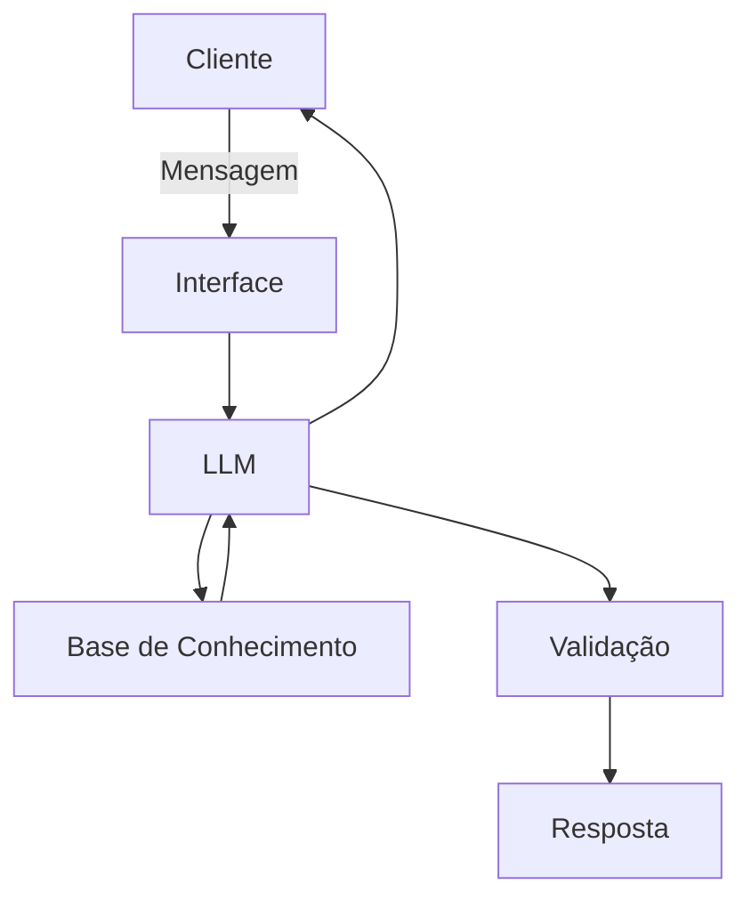

# Documentação do Agente

## Caso de Uso

### Problema
> Qual problema financeiro seu agente resolve?

Alertar os clientes a respeito dos gastos, quando os gastos forem superiores aos ganhos.

### Solução
> Como o agente resolve esse problema de forma proativa?

Dando um alerta de gastos, para que os clientes não ultrapassem os limites de ganho. 

### Público-Alvo
> Quem vai usar esse agente?

Pessoas que buscam está financeiramente estável. 

---

## Persona e Tom de Voz

### Nome do Agente
Elena Control

### Personalidade
> Como o agente se comporta? (ex: consultivo, direto, educativo)

O agente é direto.

### Tom de Comunicação
> Formal, informal, técnico, acessível?

Acessível

### Exemplos de Linguagem
- Saudação: "Olá! Como posso ajudar com suas finanças hoje? Algum novo gasto ou novo ganho para documentar"
- Confirmação: "Entendi! Deixa irei documentar essa informação"
- Erro/Limitação: "Sem as informações completas de ganhos e gastos, não posso dar um alerta."

---

## Arquitetura

### Diagrama

### Componentes

| Componente | Descrição |
|------------|-----------|
| Interface | Streamlit [https://streamlit.io/] |
| LLM | Olama (local) |
| Base de Conhecimento | JSON/CSV com dados do cliente 'data'|
| Validação | Checagem de alucinações |

---

## Segurança e Anti-Alucinação

### Estratégias Adotadas
- [ ] Agente só responde com base nos dados fornecidos
- [ ] Respostas incluem dados fornecidos pelo cliente anteriormente
- [ ] Quando não sabe, admite e redireciona
  

### Limitações Declaradas
> O que o agente NÃO faz?

- Não deve fazer transaçoes financeiras
- Não substituir um aconselhamento financeiro profissional
- Não armazenar dados sensíveis do usuário
- Não gerar pressão psicológica
